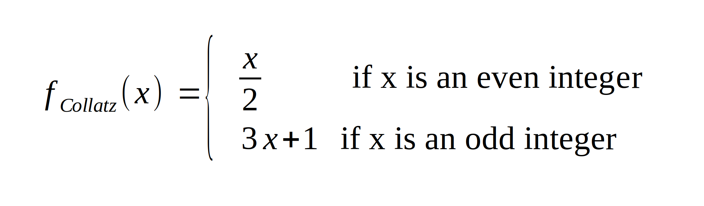

# instructions

Great to see you here :tada: Following these instructions you should be able
to solve this exercise.

## The problem - Collatz conjecture

In this exercise we will look at the Collatz conjecture and the related Collatz
sequence.

The Collatz conjecture is an unproven mathematical conjecture, stating that the
Collatz sequence of any positive integer x will eventually reach `1`.

The Collatz sequence is a sequence of numbers, generated by applying a function
to the current value to receive the next value. The next value in the Collatz
sequence following a current integer x is given by:



## Exercise

Your job is to implement a `collatz_sequence` function that returns the Collatz
sequence up to the integer `1` of a given integer. This sequence shall be
returned as a python list.

Implement this in the `collatz.py` file.

## Example

Here are some example results your function should return

```python
>>> collatz_sequence(1)
[1]

>>> collatz_sequence(2)
[2, 1]

>>> collatz_sequence(3)
[3, 10, 5, 16, 8, 4, 2, 1]
```

## Test

To test your implementation, this exercise comes with a predefined test suite.
To run this test suite, execute the `collatz.test.py` file in this folder
with python3:

```bash
python3 collatz.test.py
```
